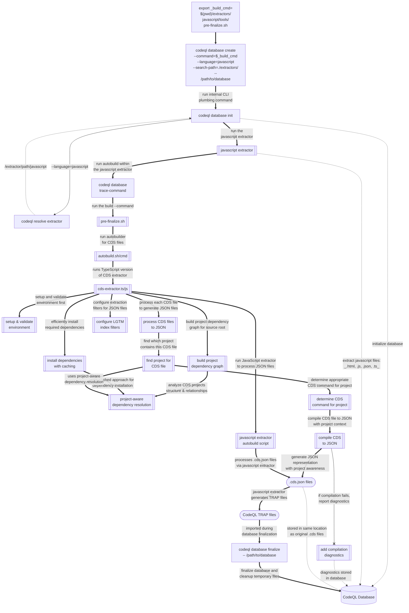

# `advanced-security/codeql-sap-js` : `extractors/README.md`

## CodeQL CDS Extractor : Overview

The CodeQL CDS Extractor is a specialized component designed to process and analyze Core Data Services (CDS) files used in SAP Cloud Application Programming (CAP) model applications. This extractor expands CodeQL's static analysis capabilities to detect security vulnerabilities, bugs, and quality issues in CDS files.

Key capabilities of the extractor include:

- Compiling `.cds` files to an intermediate JSON representation
- Handling SAP CAP dependencies and managing compiler versions
- Integrating with the JavaScript extractor for comprehensive analysis
- Converting CDS code to CodeQL's TRAP format for database inclusion
- Supporting both Windows and Unix-like environments through platform-specific wrapper scripts

The extractor operates as an extension to the JavaScript extractor, complementing its ability to analyze JavaScript, TypeScript, and JSON files with support for the CDS domain-specific language.

## CodeQL CDS Extractor : Flowchart

The following flowchart shows the flow of execution for the current implementation of the extractor.

